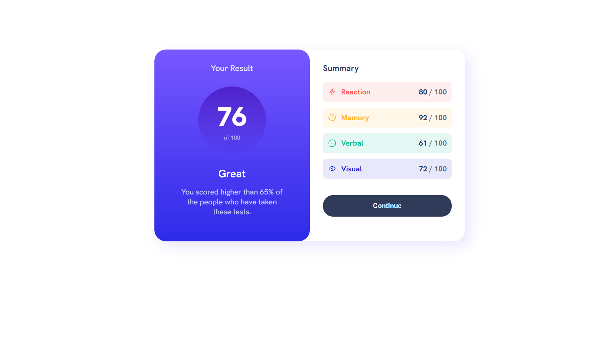

# Frontend Mentor - Results summary component solution

This is a solution to the [Results summary component challenge on Frontend Mentor](https://www.frontendmentor.io/challenges/results-summary-component-CE_K6s0maV). Frontend Mentor challenges help you improve your coding skills by building realistic projects. 

## Table of contents

- [Overview](#overview)
  - [The challenge](#the-challenge)
  - [Screenshot](#screenshot)
  - [Links](#links)
- [My process](#my-process)
  - [Built with](#built-with)
  - [What I learned](#what-i-learned)
- [Author](#author)

## Overview

### The challenge

Users should be able to:

- View the optimal layout for the interface depending on their device's screen size
- See hover and focus states for all interactive elements on the page
- Use the local JSON data to dynamically populate the content

### Screenshot

### Links

- Solution URL: [Solution](https://www.frontendmentor.io/solutions/results-sumary-component-using-a-json-file-ToP6kgF8KM)
- Live Site URL: [Results sumary component](https://justcaiodev.github.io/Results-sumary-component/)

## My process

### Built with

- Semantic HTML5 markup
- CSS custom properties
- Flexbox
- Responsivity
- Dynamic informations from a json file
- Fake API consume

### What I learned

I learned how to take information from a json file and manipulate the DOM to display this information on the screen

## Author

- Website - [Caio Azevedo](https://github.com/justCaioDev)
- Frontend Mentor - [@justCaioDev](https://www.frontendmentor.io/profile/justCaioDev)
- LinkedIn - [Caio Azevedo](https://www.linkedin.com/in/caiio/)
